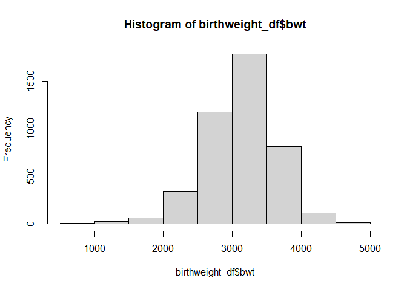
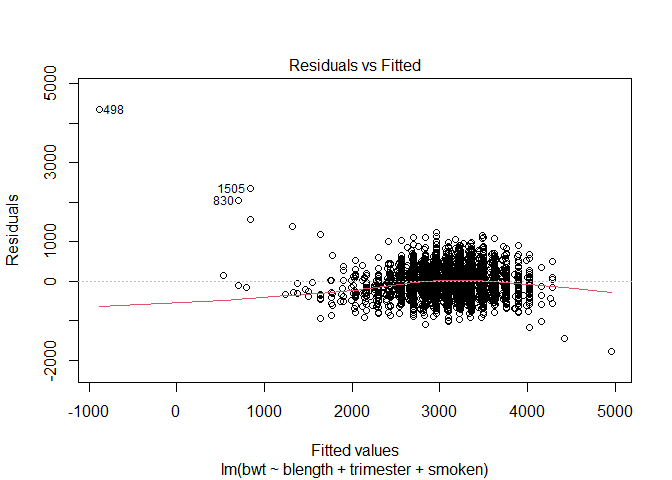
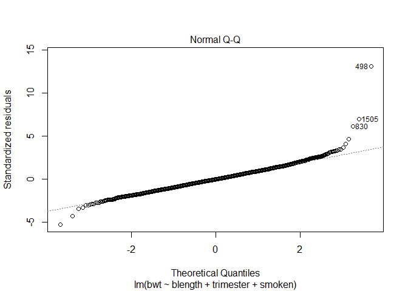
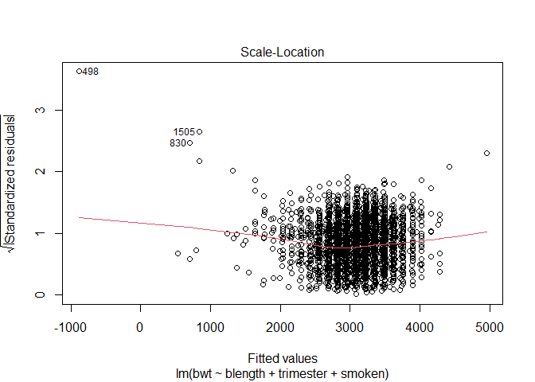
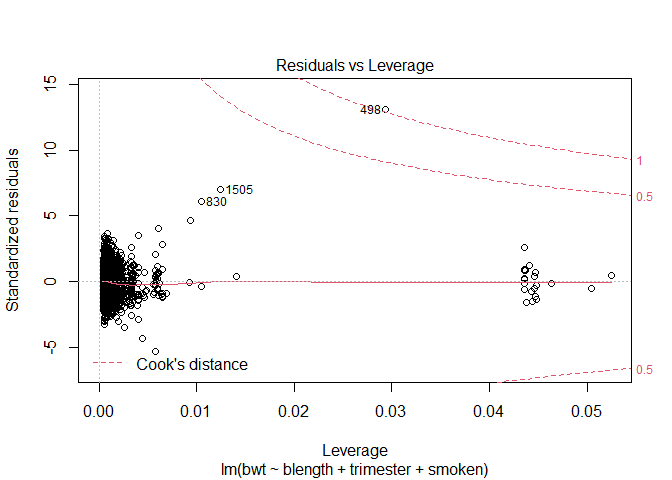
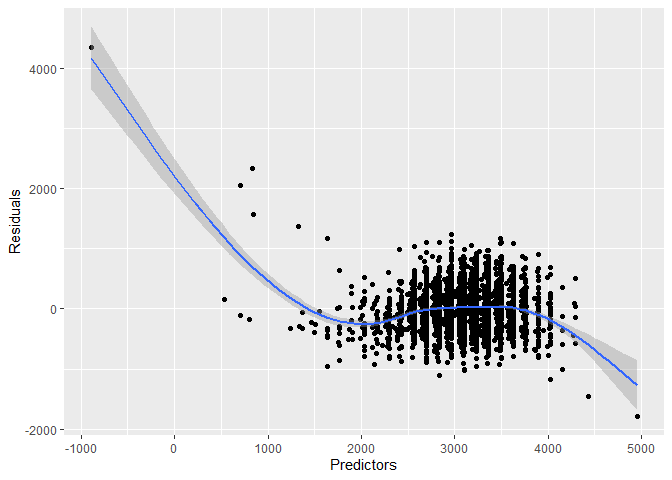
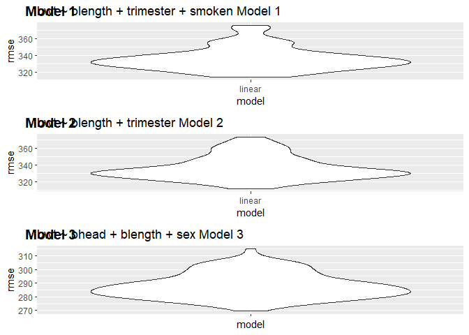
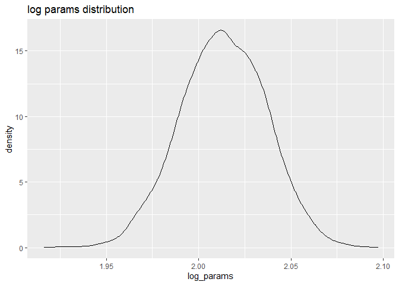

p8105\_hw6\_br2598
================
Brandon Rojas
11/24/2021

## Problem 1

**Loading and cleaning data**: (i.e. convert numeric to factor where
appropriate, check for missing data, etc.).

We ignore pnumlbw and pnumgsa because they lack values. Remove one row
with menarche at age 0 We do not remove any entries based on birthweight
because of the wide variability within premature births, with weights as
low as 300g plausible \[1\]. Convert the following into metric

(lbs -&gt; g) ppwt

wtgain

delwt

(in -&gt; cm)

mheight

\[1\] Glass HC, Costarino AT, Stayer SA, Brett CM, Cladis F, Davis PJ.
Outcomes for extremely premature infants. Anesth Analg.
2015;120(6):1337-1351.

``` r
birthweight_df = read_csv("birthweight.csv") %>%
  filter(menarche > 0)  %>%  #menarche at 0 years improbable though theoretically possible (8 months lowest in history). More likely typo for 10.
  mutate(
    babysex = as_factor(babysex),
    frace = as_factor(frace),
    malform = as_factor(malform),
    mrace = as_factor(mrace),
    parity = as_factor(parity),
    ppwt   = ppwt * 453.59237 %>% round(4),
    wtgain = wtgain * 453.59237 %>% round(4),
    delwt  = delwt * 453.59237 %>% round(4),
    mheight = mheight*2.54 %>% round(4),
    trimester = cut(gaweeks, breaks=c(0, 13, 26, 40, 52))
  ) 
```

    ## Rows: 4342 Columns: 20

    ## -- Column specification --------------------------------------------------------
    ## Delimiter: ","
    ## dbl (20): babysex, bhead, blength, bwt, delwt, fincome, frace, gaweeks, malf...

    ## 
    ## i Use `spec()` to retrieve the full column specification for this data.
    ## i Specify the column types or set `show_col_types = FALSE` to quiet this message.

``` r
levels(birthweight_df$trimester) <- c("First Trimester","Second Trimester", "Third Trimester","Over 40wks")

#   pnumlbw = as_factor(pnumlbw), None in data set.
#   pnumgsa = as_factor(pnumgsa)
```

*Propose a regression model for birthweight. This model may be based on
a hypothesized structure for the factors that underly birthweight, on a
data-driven model-building process, or a combination of the two.
Describe your modeling process and show a plot of model residuals
against fitted values – use add\_predictions and add\_residuals in
making this plot.*

We propose a model to predict bwt based on blength, trimester and
smoking status. Before fitting the model we test our hypothesis to
assess significance and see if there is value in generating a model.

First we rapidly test our normality and linearity assumption.

``` r
hist(birthweight_df$bwt)
```

<!-- -->

``` r
#testing linearity
fit = lm(bwt ~ blength + trimester + smoken, data = birthweight_df)
plot(fit) #also use to test our output and compare with our ggplot predictor vs residual 
```

<!-- --><!-- --><!-- --><!-- -->

Both hold. Continuing.

Quick anova to see if our model is different from just using a single
variable.

``` r
fit_null = lm(bwt ~ blength, data = birthweight_df)
fit_alt = lm(bwt ~ blength + trimester + smoken, data = birthweight_df)

anova(fit_null, fit_alt) %>% 
  broom::tidy()
```

    ## # A tibble: 2 x 6
    ##   res.df        rss    df     sumsq statistic   p.value
    ##    <dbl>      <dbl> <dbl>     <dbl>     <dbl>     <dbl>
    ## 1   4339 509282072.    NA       NA       NA   NA       
    ## 2   4336 491670061.     3 17612011.      51.8  7.17e-33

Plot residual vs fit of model 1.

``` r
fit = lm(bwt ~ blength + trimester + smoken, data = birthweight_df)


fit = add_residuals(birthweight_df, fit) %>% 
  add_predictions(fit)

  ggplot(fit, aes(x = pred, y = resid)) +
  geom_point() +
    stat_smooth() + 
  labs(x = "Predictors", y = "Residuals")
```

    ## `geom_smooth()` using method = 'gam' and formula 'y ~ s(x, bs = "cs")'

<!-- -->

Performing cross validation and checking RMSE across model 1 and
variations of it.

``` r
model_1_cv_df = 
  crossv_mc(birthweight_df, 100)

model_1_cv_df = 
  model_1_cv_df %>% 
  mutate(
    linear_mod  = map(train, ~lm(bwt ~ blength + trimester + smoken, data = birthweight_df))) %>% 
  mutate(
    rmse_linear = map2_dbl(linear_mod, test, ~rmse(model = .x, data = .y)))

m1_plot = model_1_cv_df %>% 
  select(starts_with("rmse")) %>% 
  pivot_longer(
    everything(),
    names_to = "model", 
    values_to = "rmse",
    names_prefix = "rmse_") %>% 
  mutate(model = fct_inorder(model)) %>% 
  ggplot(aes(x = model, y = rmse)) + 
  geom_violin() + 
  ggtitle("bwt ~ blength + trimester + smoken Model 1")
```

“recall that RMSE has the same unit as the dependent variable (DV).” -
<https://stats.stackexchange.com/questions/56302/what-are-good-rmse-values>

## Comparison model: **Model 2**

One using length at birth and gestational age as predictors (main
effects only)

``` r
blength_gaweek_fit = lm(bwt ~ blength + trimester, data = birthweight_df)
 
model_2_cv_df = 
  crossv_mc(birthweight_df, 100)

model_2_cv_df = 
  model_2_cv_df %>% 
  mutate(
    linear_mod  = map(train, ~lm(bwt ~ blength + trimester, data = birthweight_df))
) %>% 
  mutate(
    rmse_linear = map2_dbl(linear_mod, test, ~rmse(model = .x, data = .y)) )


m2_plot = model_2_cv_df %>% 
  select(starts_with("rmse")) %>% 
  pivot_longer(
    everything(),
    names_to = "model", 
    values_to = "rmse",
    names_prefix = "rmse_") %>% 
  mutate(model = fct_inorder(model)) %>% 
  ggplot(aes(x = model, y = rmse)) + 
  geom_violin() + 
  ggtitle("bwt ~ blength + trimester Model 2")
```

## Comparison model: **Model 3**

One using head circumference, length, sex, and all interactions
(including the three-way interaction) between these

``` r
three_way_fit = lm(bwt ~ bhead + blength + babysex + bhead * blength * babysex, data = birthweight_df)

#  ggplot(aes(x = borough, y = resid)) + geom_violin() x = predictor, y = resid

model_3_cv_df = 
  crossv_mc(birthweight_df, 100)

model_3_cv_df = 
  model_3_cv_df %>% 
  mutate(
    linear_mod  = map(train, ~lm(bwt ~ bhead + blength + babysex + bhead * blength * babysex, data = birthweight_df))) %>% 
  mutate(
    rmse_linear = map2_dbl(linear_mod, test, ~rmse(model = .x, data = .y)))


m3_plot = model_3_cv_df %>% 
  select(starts_with("rmse")) %>% 
  pivot_longer(
    everything(),
    names_to = "model", 
    values_to = "rmse",
    names_prefix = "rmse_") %>% 
  mutate(model = fct_inorder(model)) %>% 
  ggplot(aes(x = model, y = rmse)) + 
  geom_violin() +
  ggtitle("bwt ~ bhead + blength + sex Model 3")
```

Comparing RMSE of each, easy to spot that the linear model for Model 3
is the most optimal.

``` r
model_num <- c('Model 1', 'Model 2', 'Model 3')
mean_rmse <- c(mean(model_1_cv_df$rmse_linear), mean(model_2_cv_df$rmse_linear), mean(model_3_cv_df$rmse_linear))


mean_rmse_df <- data.frame(model_num, mean_rmse)

mean_rmse_df
```

    ##   model_num mean_rmse
    ## 1   Model 1  336.3076
    ## 2   Model 2  336.5188
    ## 3   Model 3  287.9618

``` r
ggarrange(m1_plot, m2_plot, m3_plot + rremove("x.text"), 
          labels = c("Model 1", "Model 2", "Model 3"),
          ncol = 1, nrow = 3)
```

<!-- -->

## Problem 2

``` r
weather_df = 
  rnoaa::meteo_pull_monitors(
    c("USW00094728"),
    var = c("PRCP", "TMIN", "TMAX"), 
    date_min = "2017-01-01",
    date_max = "2017-12-31") %>%
  mutate(
    name = recode(id, USW00094728 = "CentralPark_NY"),
    tmin = tmin / 10,
    tmax = tmax / 10) %>%
  select(name, id, everything())
```

    ## Registered S3 method overwritten by 'hoardr':
    ##   method           from
    ##   print.cache_info httr

    ## using cached file: C:\Users\Brandon\AppData\Local/Cache/R/noaa_ghcnd/USW00094728.dly

    ## date created (size, mb): 2021-10-17 22:14:27 (7.62)

    ## file min/max dates: 1869-01-01 / 2021-10-31

set up the bootstrap

``` r
 strap_df = weather_df %>% 
  bootstrap(n = 5000, id = "bootstrap_num") %>%
  mutate(
    boot = map(strap, as_tibble),
    models = map(boot, ~lm(tmax ~ tmin, data = .x)),
    result_r = map(models, broom::tidy), #for parameter 
    result_summary = map(models, broom::glance)) #for r^2 

#leftover from class code 
  # select(-strap, -models) %>% 
  # unnest(results) %>% 
  # group_by(term) %>% 
  # summarize(boot_se = sd(estimate))
```

Fish out r\_hat^2, find the CV and plot.

``` r
#takign out rsqr
r_hat_squared = strap_df %>% 
  select(bootstrap_num, result_summary) %>%
  unnest(result_summary) %>%
  select(r.squared)

#find CV
r_hat_ci = r_hat_squared %>% summarise(
  upper_ci = quantile(r.squared, 0.975),
  lower_ci = quantile(r.squared, 0.025)
  )


r_hat_squared %>% ggplot(aes(x = r.squared)) + 
  geom_density() + 
  ggtitle("r^2 distribution")
```

<!-- -->

The result appears to be approximately normal with a 95% CV of
({0.8936448}, {0.9274221} )

## Parameters

``` r
#repeat as above
param = strap_df %>%
  select(bootstrap_num, result_r) %>%
  unnest(result_r) %>%  #now pull out the estimate, filter out all the intercepts, and create the log params. 
  select(term, estimate) %>%
 pivot_wider(
     names_from = term,
     values_from = estimate
   ) %>%   #widen so that intercept and tmin are multiplicable
  unnest() %>%
  janitor::clean_names() %>% #unworkable intercept name
  mutate(
    log_params = log(intercept*tmin)
  )
```

    ## Warning: Values are not uniquely identified; output will contain list-cols.
    ## * Use `values_fn = list` to suppress this warning.
    ## * Use `values_fn = length` to identify where the duplicates arise
    ## * Use `values_fn = {summary_fun}` to summarise duplicates

    ## Warning: `cols` is now required when using unnest().
    ## Please use `cols = c(`(Intercept)`, tmin)`

``` r
#find CV
log_param_ci = param %>% summarise(
  upper_ci = quantile(log_params, 0.975),
  lower_ci = quantile(log_params, 0.025)
  )


param %>% ggplot(aes(x = log_params)) + 
  geom_density() + 
  ggtitle("log params distribution")
```

<!-- -->

The result also appears to be approximately normal with a 95% CV of
({1.9666102}, {2.0581145} )
